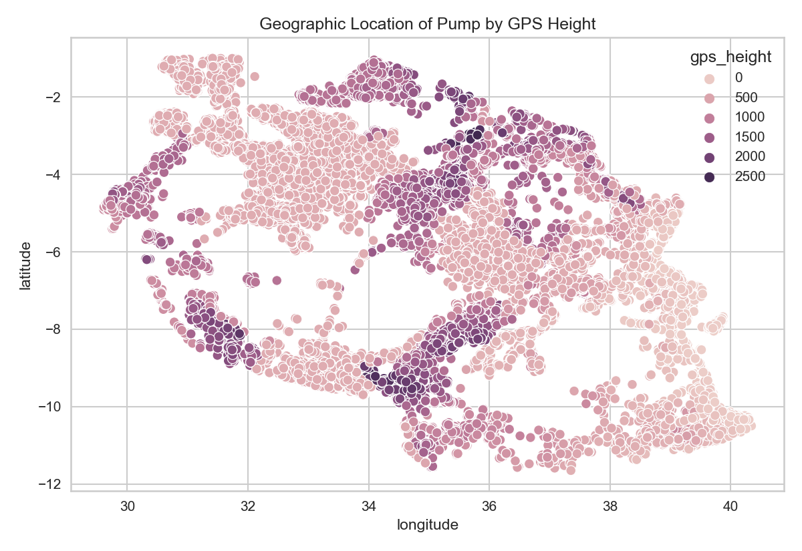
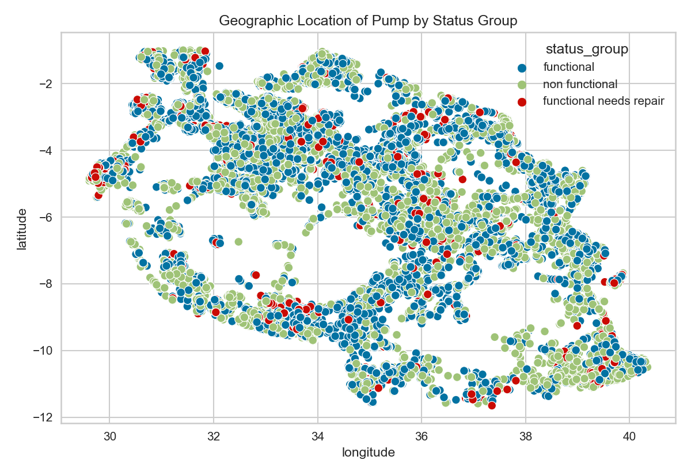
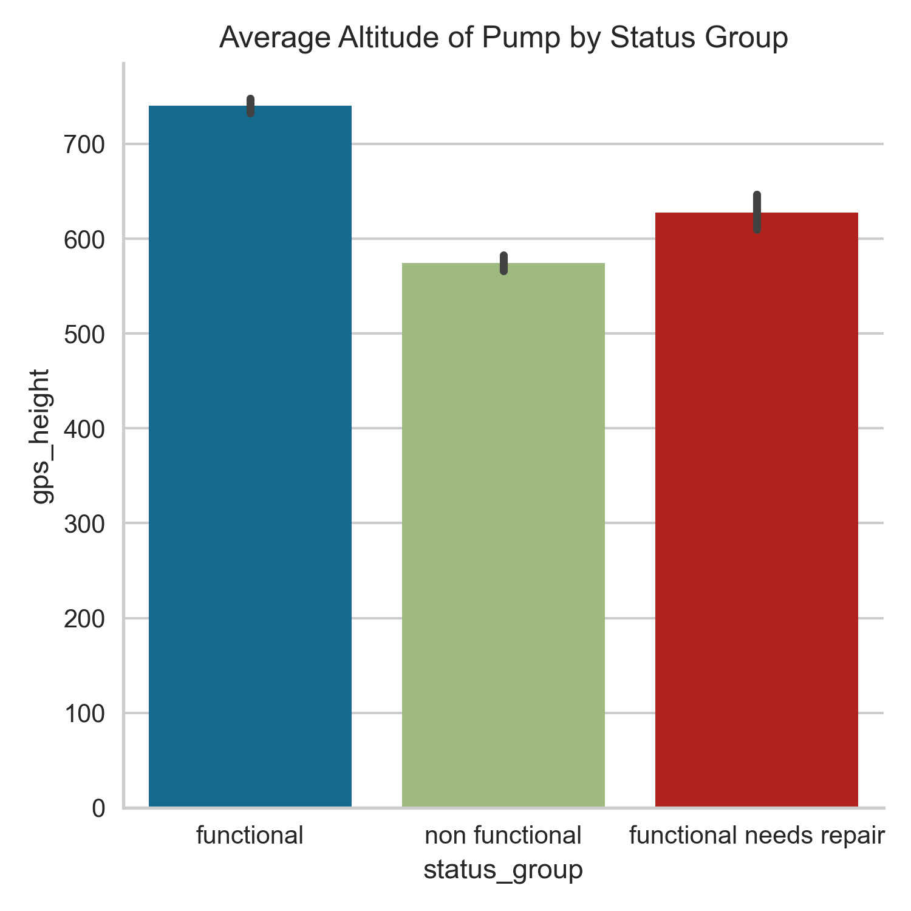
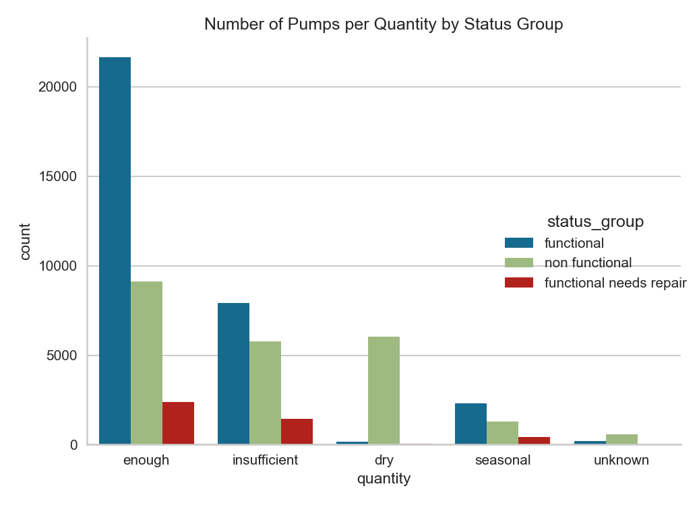
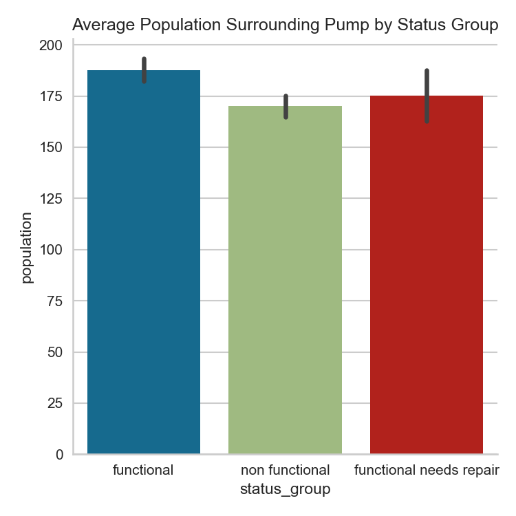
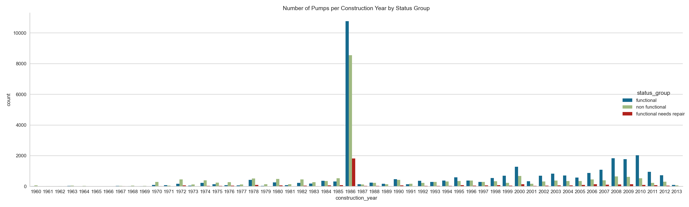

# Pump it Up: Data Mining the Water Table
## Predicting the functional status of Tanzanian water pumps

**Authors**: Peder Norr

### Overview:

A smart understanding of which water pumps will fail can improve maintenance operations and ensure that clean, potable water is available to communities across Tanzania. This proposal contains an analysis of Tanzanian water pump data in order to provide the Tanzania Ministry of Water a tool with which to determine water pump functionality and information on how to improve pump maintenance efficiency. Initial analysis of water pump data shows that the location of a pump, the age of a pump, the size of population surrounding the pump, and the quantity of water a pump has access to are the biggest indicators of a pumps's functionality status. The Tanzanian Ministry of Water can use this analysis to improve prediction and identification of which pumps are non functional or may need repair, therefore increasing access to potable water across Tanzania.

### Business problem:

The Tanzania Ministry of Water is trying to improve their water pump maintenance operations in order to ensure that clean, potable water is available to communities across Tanzania. In order to accomplish this, the Ministry wants to be able to better predict which pumps will fail, and to better identify pumps that need repair now. This is in hopes of improving maintenance efficiency and water access. Using water pump data, I create a model that can help identify pumps needing repair and characteristics that may indicate pump failure in the future.


### Data:

The data used in this analysis come from the Taarifa waterpoints dashboard, which aggregates data from the Tanzania Ministry of Water, by way of the [DrivenData Pump it Up: Data Mining the Water Table](https://www.drivendata.org/competitions/7/pump-it-up-data-mining-the-water-table/data/) competition. The data set contains  41 variables describing pump functionality status (the target variable), pump geographic location, what kind of pump is operating, when it was installed, how it is managed, etc. It includes data on 59,400 individual pumps recorded from 2011-2013.


## Methods

In this analysis, I create and iterate through several random forest classifier models with the goal of creating a model capable of being a useful tool to help the Tanzanian Ministry of Water better predict water pump status and improve pump maintenance efficiency. I improved my model's iterations by adjusting hyperparameters. This was done in an attempt to increase the accuracy, recall, and precision of the model.


## Results

#### Pump location may help indicate status






> The figures above show pump location sorted by pump status and altitude. Non functional status and lower altitude seem to correlate.

#### Lower water quantity in a pump may indicate non functional status


> Pumps with lower water quantities may be more likely to be non functional or needing repair.

#### Lower population areas may indicate non functional status


> Pumps in lower population areas may be more likely to be non functional or needing repair.

#### Older pumps may indicate non functional status


> Older pumps may be more likely to be non functional or needing repair.

## Recommendations:

Based on this random forest classifier model, I would provide four recommendations to the Tanzanian Ministry of Water as they look to improve pump status prediction and maintenance efficiency:

- **Location** `Longitude`, `latitude`, and `gps height` were some of the most important features in the random forest classifier. Based on the analysis, pumps in lower altitude areas may be more likely to need repair or be non functional. The Ministry should focus resources on lower altitude pumps.

- **Quantity** `Quantity` was one of the most important features in the random forest classifier. Analysis showed that pumps with lower quantities of water were more likely to be non functional or needing repair. The Ministry should focus resources on pumps with low quantities of water.

- **Population** `Population` was one of the most important features in the random forest classifier. Analysis showed that pumps in lower population areas may be more likely to be non functional or needing repairs. The Ministry of Water should focus resources on low population areas, as they may not be receiving enough.

- **Construction Year** `Construction Year` was one of the most important features in the random forest classifier. Analysis showed that older pumps may be more likely to be nonfunctional or needing repair. The Ministry should focus resources on modernizing older pumps.


## Limitations & Next Steps

However, the random forest model and analysis are not complete solutions, nor are they perfect. The final model still struggles with correctly identifying pumps classified as `functional needs repair`, too often mistaking them for `functional` pumps. But as `functional needs repair` pumps make up a very small part of the data set, I believe this to be a tolerable risk and that the model is accurate to a degree that makes it useful for the Ministry of Water as a tool to improve pump status prediction and maintenance efficiency.

I could improve this analysis in the future by further transforming and scrubbing the data to create more helpful features and cleaner data, further tweaking the hyperparameters of the model, or by utilizing a LightGBM, or CatBoost model to try and increase recall and accuracy, and decrease computing time.


### For further information
Please review the narrative of our analysis in [my jupyter notebook](./water_pump_classification-final.ipynb) or review our [presentation](./WaterPumpClassificationDeck.pdf)

For any additional questions, please contact Peder Norr at <norr.peder@gmail.com>


##### Repository Structure:

```

├── README.md                         <- The top-level README for reviewers of this project.
├── water_pump_classification.ipynb   <- narrative documentation of analysis in jupyter notebook
├── WaterPumpClassificationDeck.pdf   <- pdf version of project presentation
└── images
    └── images                        <- both sourced externally and generated from code
└── data
    └── 

```
